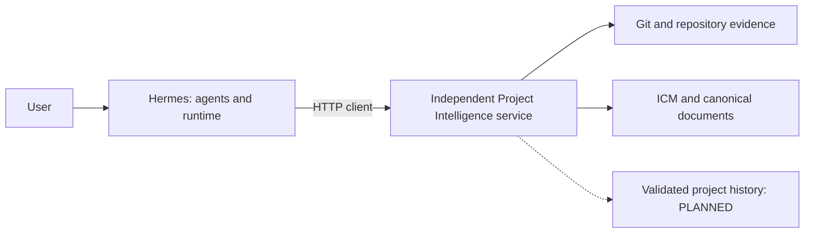

# Hermes Project Map

**Project Intelligence and coordination for AI coding agents.**

AI models can produce more of the implementation. This project explores the
context, boundaries and project knowledge needed to make that work inspectable
and better coordinated, especially when several agents work on the same codebase.

Hermes Project Map is the current working name. Its scope has grown beyond code
visualization; neither the repository nor the product has been renamed.

## Why this exists

For the author, Codex began as a coding assistant. As more implementation was
delegated to AI, the human focus shifted toward architecture, decomposition,
direction and validation. Experiments with Hermes, reusable profiles and ICM
inspired a broader project-intelligence layer. This is the author's development
experience, not a universal claim about those tools. [Read the evolution →](docs/VISION.md)

## The problem

Multi-agent coding needs more than the ability to generate code:

- selective context, rather than a full repository dump;
- project identity and Git/worktree awareness;
- evidence of change impact;
- explicit task boundaries;
- coordination between concurrent changes, even across different files;
- project history that does not override current code.

ICM, discovered through Clif Notes, inspired structured, selective context.
**In this design, ICM is an input to Project Intelligence, not the entire
system.** Smaller prompts alone do not establish whether two changes are compatible.

## The approach

Current context composition:

```text
Task + Project Identity / Git Revision + ICM
     + Analyzer Providers / normalized code evidence
     → bounded Task Context Pack
```

This is deterministic evidence selection, not arbitrary LLM summarization.
Packs carry provenance, limits and incomplete-coverage signals. Future impact,
scope, conflict and validated-history layers will build on this foundation;
they are not implemented by the current pack.

## Hermes relationship

| Hermes owns execution | This project owns project intelligence |
|---|---|
| Runtime, agents, profiles/SOULs | Project identity, understanding and ICM |
| Model/provider execution | Code analysis and bounded Context Packs |
| Kanban/tasks, workers, dispatch | Impact and effective task-scope intelligence |
| Worktrees, sessions, retries | Conflict intelligence and project knowledge |

This is an ownership boundary, not a completion checklist. **The service is not
a replacement for Hermes or another orchestrator.** An AnalyzerProvider analyzes
code evidence; it is not the LLM/provider routing that belongs to Hermes.
Automatic Hermes guard integration remains planned.

## Core concepts

[Concepts →](docs/CONCEPTS.md): Profile != Model · ICM != Runtime · Project
Identity · Git Revision / Worktree · Context Pack · Analyzer Provider Layer ·
Structural vs semantic evidence · Impact · Workspace vs Effective Task Scope ·
WRITE / RESERVED / WATCH / IMPACT · Conflict Intelligence · Project Expert.

## Current status

Implementation checkpoint: [verified Serena/Python checkpoint](docs/CURRENT_STATUS.md)
on `feat/serena-external-provider`.

- **Complete:** project foundation; Step 1 Project Identity / Revision; Step 2
  Task Context Pack; Step 2.5 Analyzer Provider Layer.
- **Implemented:** local HTTP API and graph UI, bounded discovery/overview,
  canonical ICM indexing and workspace matching, persisted project identity,
  Git/worktree evidence and revision-aware caches, read-only Context Packs,
  normalized provider selection/fallback and snapshot-bound external data validation.
- **Next, not started:** Step 3 — Impact v2. Existing node-based graph impact is
  an earlier capability, not completion of this step.
- **Planned:** effective scope, conflicts, Hermes guard integration, project
  telemetry/validated history, Project Expert and learning/evaluation.
- **Implemented, opt-in:** sandboxed Serena/Pyright semantic symbols, definitions
  and references for Python. [Pinned image and runtime guide](docker/serena-python/README.md).
  No runtime network, live-repository mount, editor, memory or agent operations.

Native C#/.NET, TypeScript and JavaScript/JSX analysis is **structural**, not
compiler-grade semantic analysis. Python has semantic evidence only when the
optional image is built and enabled; Go/Rust/Java remain observation-only.
Bash/PowerShell have bounded text observation. Provider
extensibility does not mean semantic support for all languages or safe execution
of arbitrary plugins.

Context source retrieval requires Linux/WSL `/proc/self/fd` verification and
otherwise fails closed to partial metadata-only evidence. Packs are bounded
observations, not complete atomic snapshots or enforced WRITE permissions.

[Current status and evidence →](docs/CURRENT_STATUS.md) ·
[AnalyzerProvider contract and proposal →](docs/project-intelligence/19_ANALYZER_PROVIDER_LAYER.md)

## Architecture

Solid paths show the current evidence boundary; the dashed history path is planned.
The Hermes adapter must be configured separately; automatic task integration is
not implied by HTTP support.



The service returns evidence to Hermes; it does not dispatch workers. The graph
UI and HTTP service remain independently usable.

[Public architecture and context-flow diagrams →](docs/ARCHITECTURE.md) ·
[Detailed technical documentation →](docs/project-intelligence/00_INDEX.md)

## Try the current service

With Node.js and npm installed, configure trusted project roots using
[Adding projects](docs/adding-projects.md), then run from the repository root:

```bash
npm ci
npm start
```

Open `http://localhost:8770`. Health check: `curl http://localhost:8770/api/health`.
The server binds to all interfaces by default; keep it on a trusted local
network. See the [service reference](docs/SERVICE_REFERENCE.md) for Docker,
configuration, registration, endpoints, compatibility notes and troubleshooting.

Development verification: `npm test` and `npm run check`.

## Roadmap

```text
COMPLETE: Project foundation → Project Identity / Revision
          → Task Context Pack → Analyzer Provider Layer
NEXT / NOT STARTED: Impact v2
PLANNED: Effective Task Scope → Conflict Engine → Hermes Guard integration
         → Telemetry / validated project history → Project Expert
         → Learning / evaluation
```

This follows the [active implementation plan](.hermes/plans/2026-09-17_002050-project-intelligence-service-active.md),
not a delivery-date commitment. Context efficiency and better coordination are
objectives to evaluate, not measured savings or guarantees.

## Documentation

- [Vision](docs/VISION.md) — the author's experience and project direction.
- [Concepts](docs/CONCEPTS.md) — vocabulary, evidence levels and boundaries.
- [Architecture](docs/ARCHITECTURE.md) — current composition and future layers.
- [Current status](docs/CURRENT_STATUS.md) — checkpoint-backed capabilities.
- [Service reference](docs/SERVICE_REFERENCE.md) — current API and operations.
- [Documentation index](docs/README.md) — setup, integration and technical guides.
