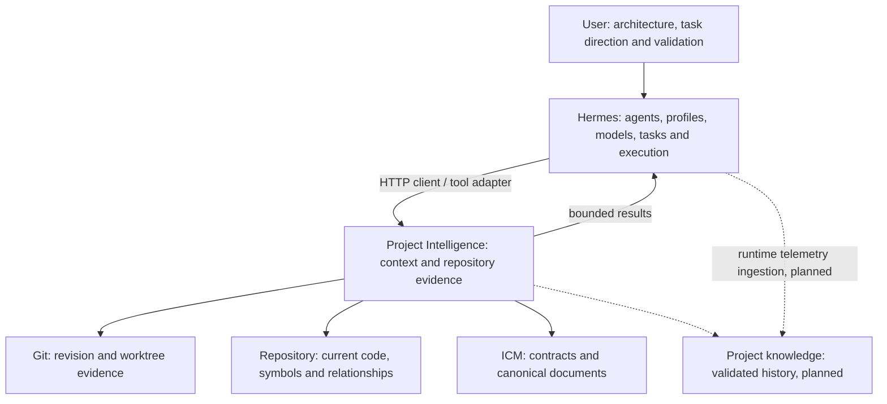
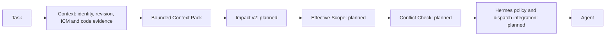
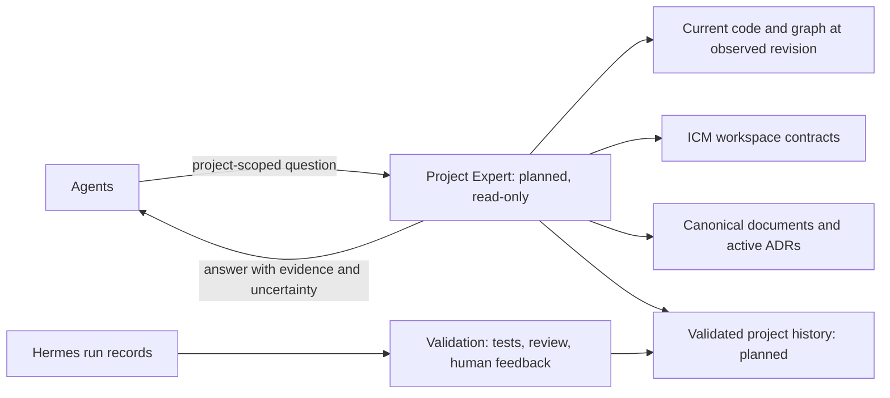

# Public architecture

[Home](../README.md) · [Vision](VISION.md) · [Concepts](CONCEPTS.md) · [Current status](CURRENT_STATUS.md)

Hermes Project Map is an external Project Intelligence service. Its existing
HTTP API and graph UI provide a foundation for the broader coordination layer.
It is not an agent runtime, scheduler or replacement for Hermes.

The diagrams below describe responsibility boundaries and the target design.
**Planned nodes are labelled explicitly.** Consult
[Current status](CURRENT_STATUS.md) for the implementation snapshot.

## System boundary

The arrows show queries and evidence flow, not a transfer of lifecycle ownership.
Hermes owns agents, profiles/SOULs, model/provider execution, Kanban/tasks,
workers, dispatch, worktrees, sessions and retries. Git owns repository content
and revision truth. This service reads project evidence and derives intelligence.

HTTP is implemented. The repository includes a guide for a thin low-level
`project_map_*` plugin; a guide is not evidence that a plugin is installed in a
particular Hermes runtime. High-level task/scope tools, an MCP adapter and
automatic guard integration are not established by the current service API.

## Existing service foundation

| Component | Current role |
|---|---|
| Configuration, roots and registry | Resolve trusted locations, separate manual/discovered state and preserve persisted project IDs. |
| Discovery and overview | Return bounded candidate discovery and compact project/revision summaries. |
| Analyzer service and graph UI | Inspect supported code, search symbols and explore relationships; provide existing node-based graph impact/context. |
| ICM foundation | Parse workspace contracts, index contextual documents and match task paths to declared workspace scope. |
| Task Context Pack builder | Compose bounded, revision-aware evidence for a task without an LLM or persistent pack cache. |

Analyzer-provider normalization is **Phase 2.5, in progress** at this document's
base. Do not infer a completed provider pipeline from the table above.

The API offers discovery, explicit guarded discovered-project registration,
project overview and a read-only task-context POST. Legacy exploration/indexing
and cache operations remain separate. See the [service reference](SERVICE_REFERENCE.md)
for methods and paths, rather than treating proposed tool names as existing APIs.

### A Context Pack is a join, not an ICM dump

The current builder resolves a persisted projectId and optional verified
worktree, observes bounded sources and Git state, then reuses ICM and analyzer
logic to select task-relevant evidence. It returns bounded sections with
provenance and omission indicators, and rejects observed changes during
construction. It does not create a whole-repository atomic snapshot.

ICM describes declared process and workspace context; source analysis describes
what the code contains. Neither alone establishes safe task coordination.
The target combines them with richer impact, scope/conflict evidence and
validated historical knowledge.

## Task flow

**Target flow:** the first context capability exists; Impact v2, effective scope,
conflict checking and the automatic Hermes enforcement path remain planned.
Existing node-based graph impact is a separate current capability.

This is a conceptual sequence, not a series of endpoints to call today. Impact
can also feed back into context selection. In the intended integration, a
conflict result may lead Hermes to block, serialize or request replanning rather
than starting the agent.

## Scope and parallel work

Workspace scope declares general responsibility. Effective task scope is the
planned revision-bound interpretation for a particular change:

- **WRITE:** allowed mutation targets.
- **RESERVED:** strongly coupled areas protected from another task's writes.
- **WATCH:** affected areas where policy may allow concurrency with revalidation.
- **IMPACT:** informational effects, not locks by default.

Worktrees isolate working directories; these semantics address logically
incompatible changes across them. Project Intelligence would return conflict
evidence, while Hermes owns scheduling and enforcement. Runtime checks must
also address shell mutations and final diff validation; file-tool hooks alone
are not a sandbox.

See the [parallel-agent diagram and example](CONCEPTS.md#write--reserved--watch--impact)
and [scope/impact/conflict design](project-intelligence/06_SCOPE_IMPACT_CONFLICTS.md).

## Future Project Expert

**Entire capability planned.** The Project Expert is a read-only consumer of
project evidence, not a coder or a new authority over the repository.

Current truth is retrieved, not assumed from model weights. Historical
observations need project/revision provenance, validation and lifecycle status.
An agent's conclusion is a candidate observation, not automatically active
knowledge. Superseded decisions and proposals remain labelled as such.

Hermes retains authoritative task/run telemetry. Planned ingestion adds project,
revision, context and scope metadata rather than creating a competing task
lifecycle database. Honcho remains experiential memory, not proof of current
code. Future learning/adaptation depends on validated data and evaluation.

## Trust, state and limitations

- **Content is not policy.** `AGENT.md` front matter is authoritative for declared
  workspace fields; repository prose and request text cannot override runtime
  policy. Current Context Pack constraints are declared-only.
- **Identity is not location.** A persisted projectId survives explicit locator
  maintenance; checkout evidence identifies the observation. A worktree is not
  automatically enrolled as another project.
- **Derived state is disposable.** Current ICM indexes and Context Packs are
  composed on demand, without persistent stores. Existing analyzer caches have
  their own revision/worktree rules. Planned scope/conflict/history storage must
  preserve ownership and provenance rather than duplicate Hermes runtime state.
- **Bounded does not mean complete.** Current source retrieval requires
  Linux/WSL `/proc/self/fd` verification and can return partial evidence. No
  complete dependency, secret-detection or concurrent-filesystem guarantee is
  implied. Inspect diagnostics and truncation before using a pack.

## Deep architecture references

| Topic | Technical document |
|---|---|
| Responsibility boundary and target flow | [Target architecture](project-intelligence/03_TARGET_ARCHITECTURE.md) |
| Current pack contract and longer-term context design | [ICM and Context Pack](project-intelligence/04_ICM_AND_CONTEXT_PACK.md) |
| Client/guard integration | [Hermes integration](project-intelligence/05_HERMES_INTEGRATION.md) |
| Project/revision/worktree identity | [Identity and isolation](project-intelligence/18_PROJECT_IDENTITY_AND_ISOLATION.md) |
| Scope and conflict policy | [Scope, impact and conflicts](project-intelligence/06_SCOPE_IMPACT_CONFLICTS.md) |
| Data ownership and derived entities | [State and data model](project-intelligence/30_STATE_AND_DATA_MODEL.md) |
| Trust boundaries | [Threat model](project-intelligence/31_THREAT_MODEL_AND_TRUST_BOUNDARIES.md) |
| Runtime telemetry reuse | [Telemetry ingestion](project-intelligence/19_HERMES_TELEMETRY_INGESTION.md) |
| Read-only expert and validated history | [Project Expert data pipeline](project-intelligence/26_PROJECT_EXPERT_DATA_PIPELINE.md) |
| Evidence precedence and staleness | [Knowledge precedence](project-intelligence/28_KNOWLEDGE_PRECEDENCE_AND_DRIFT.md) |
| Evaluation direction | [Observability and learning](project-intelligence/08_OBSERVABILITY_AND_LEARNING.md) |

These technical documents contain target schemas and historical checkpoints as
well as implemented contracts. Their examples are not all available APIs.
The [technical index](project-intelligence/00_INDEX.md) explains how to read them.
