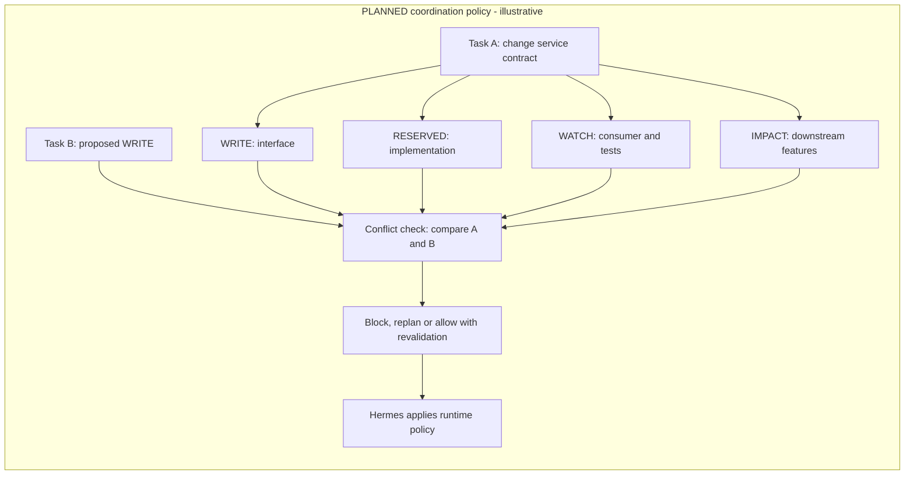

# Core concepts

[Home](../README.md) · [Vision](VISION.md) · [Architecture](ARCHITECTURE.md) · [Current status](CURRENT_STATUS.md)

These terms describe both the existing foundation and the target design.
**Implemented** means present at the revision recorded in
[Current status](CURRENT_STATUS.md); **planned** does not mean available through
today's API. Architectural principles are not executable features by themselves.

## Profile != Model

A **profile** expresses a reusable role and capabilities: architect,
implementer, tester, reviewer or documenter. A **model** is the inference engine
used for a run; its **provider** is a runtime execution choice.

A role should remain useful when its model changes. Project context binds that
role to a task; it should not require a separate copy of the role for every
repository. Hermes owns profiles/SOULs and model/provider execution. Future
Project Intelligence risk or capability hints may inform runtime choices, but
the service does not select or execute an LLM today.

See [profile capabilities](project-intelligence/29_PROFILE_CATALOG_AND_CAPABILITIES.md)
and [runtime routing boundaries](project-intelligence/22_MODEL_ROUTING_AND_TOKEN_BUDGETS.md).

## ICM != Runtime

In this project's design, ICM is the versioned workflow/context input: what is
being done, its inputs, constraints, process, outputs and success criteria. It is not the machinery
that launches a worker, chooses a provider, retries execution or manages tasks.
Folders and workspace documents are not agents.

**Implemented foundation:** the service parses canonical `AGENT.md` YAML front
matter, builds a Workspace Index and contextual document index, and combines
them into an on-demand Project ICM Index. It also matches task paths to declared
workspace scope.

- `AGENT.md` front matter is the machine-authoritative workspace **declaration**.
- Its Markdown body, `AGENTS.md`, `PROJECT.md`, `CONTEXT.md` and ADR Markdown are
  contextual text. They cannot override structured permissions or scope fields.
- Declarations are not effective runtime permissions. The service does not
  enforce agent execution policy.

`AGENT.md` (singular) and `AGENTS.md` (plural) have different roles; they are not
interchangeable filenames. A workflow-stage resolver and automatic runtime
integration are not implied by the existing index.

See [Project ICM](project-icm.md) and the
[Context Pack contract](project-intelligence/04_ICM_AND_CONTEXT_PACK.md).

## ICM != the entire Project Intelligence system

ICM supplies declared context. Project Intelligence combines that with current
code, symbols and relationships, project/revision identity and bounded evidence
selection. The target also adds impact, effective scope, conflicts and relevant
validated history. A document index alone cannot establish the consequences of
a change or the safety of parallel work.

## Project Identity

A **projectId** is an opaque persisted project identity, not a display name,
path, remote URL or commit hash.

**Implemented:** the existing manual/discovered registry stores optional IDs;
explicit enrollment can assign them. Legacy ID-less records remain readable;
reading does not migrate them. Task Context Pack requests require an existing
persisted ID. Ambiguous lookups fail rather than silently selecting a project.

Moves require explicit locator maintenance while preserving the ID. Separate
clones/forks are separate registrations by default. The planned wider identity
model also binds Hermes boards, tasks, runs and project history; those bindings
are not delivered by basic registry identity.

See [identity and isolation](project-intelligence/18_PROJECT_IDENTITY_AND_ISOLATION.md).

## Git Revision / Worktree

**Revision evidence** describes the observed checkout: commit, branch, dirty
state and availability. A **worktree** is a checkout associated with a Git
repository, not automatically a different project.

**Implemented:** verified linked worktrees resolve under their registered
parent's projectId. Local repository/worktree evidence is distinct from the
stable projectId. Dirty, unborn, non-Git and unavailable evidence is explicit;
a parent commit is not proof that dirty content equals that commit.

Configured-root-bound lookup and safe overview projection preserve this
distinction. Both the analysis cache and the .NET symbol cache are bound to
project/revision/worktree evidence; dirty, unborn or unavailable Git states
bypass their normal cache reuse rather than borrowing a clean checkout's result.

Hermes owns worktree creation and lifecycle. This service reads worktree
identity and sources. Worktrees provide physical separation; the planned
scope/conflict layer provides semantic coordination.

## Context Pack

A **Context Pack** is a bounded, task-specific selection of project evidence,
with identity, revision, source/provenance and omission information.

**Implemented:** a read-only HTTP request composes task details, matched ICM
workspaces, relevant documents/files/symbols/direct references and heuristic
test candidates. Section and serialized-byte limits prevent an unrestricted
prompt dump; excerpts are opt-in. The builder does not require an LLM and does
not persist or cache packs.

Step 2.5 adds normalized provider metadata and evidence without replacing the
Step 2 request/section contract. `analysis` reports provider/version, capabilities,
observed/covered/uncovered languages, snapshot binding and attempts. Symbol and
reference sections preserve `partial` or `not_analyzed` status as appropriate;
missing analysis is not a proven empty graph. External evidence retains its
untrusted provenance and validated source lines where known.

Bounded is not complete: source caps can omit relevant evidence. Current source
retrieval requires Linux/WSL descriptor verification through `/proc/self/fd`;
when unavailable it fails closed to partial metadata-only results. This is a
working-tree observation with change detection, not an atomic repository
snapshot. Richer impact/history/conflict context and FAST/STANDARD/DEEP policies
are **planned**, not current request modes.

See the [implemented contract and limitations](project-intelligence/04_ICM_AND_CONTEXT_PACK.md).

## Analyzer Provider Layer

**Implemented in Step 2.5.** An **AnalyzerProvider** is a language-analysis
contract, not an LLM provider or agent profile. Task Context Pack consumers use
normalized evidence instead of depending directly on a concrete native analyzer.

The existing .NET and TypeScript/JavaScript analyzers are retained behind native
adapters. Descriptors declare provider ID/version, kind, priority, languages and
per-operation capability levels. Selection/fallback is deterministic: native
.NET, then native TypeScript/JavaScript, then configured external providers.
Eligibility respects language and capability requirements. The first usable
result may be partial; graphs from different providers are not silently merged.

The external boundary is **data-only**. Bounded JSON evidence must match its
authorized project/revision/worktree snapshot, request and provider ID/version.
Paths, source positions, IDs and advertised operations are validated. Neither
the request DTO nor its response validator launches a process or executes an
arbitrary analyzer plugin. Provider configuration and external responses are
server-side inputs, not fields exposed in the task-context HTTP request.

Printable, bounded polyglot symbol names can include qualified names or names
such as `Get-Thing`; they need not follow JavaScript identifier syntax. That
normalization improvement does not supply a semantic analyzer for those languages.

### Structural vs semantic evidence

Capability levels are per operation, not a blanket quality label for a language:

| Level | Meaning |
|---|---|
| `unsupported` | The provider does not supply the operation. Missing entries normalize to this level. |
| `structural` | Source/AST/heuristic evidence of symbols and relationships, without a compiler-grade semantic claim. |
| `semantic` | A declared language-aware operation requiring appropriate evidence and conformance validation; no current native provider offers this level. |

Default installed analysis at the documented checkpoint:

| Language | Current evidence |
|---|---|
| C# / .NET | Native structural symbols and references/import dependencies. |
| TypeScript | Native structural symbols and references/import dependencies. |
| JavaScript / JSX | Native structural analysis through the TypeScript provider. |
| Python / Go / Rust / Java | Language observation only by default; semantic analysis is not implemented. |
| Bash / PowerShell | Bounded text observation, without execution; semantic analysis is not implemented. |

Native precise definitions, implementations and compiler diagnostics are
`unsupported`. Extensibility and protocol fixtures are not proof of installed
semantic support. Optional Serena/Pyright execution is a **proposal**, subject
to a separately approved snapshot-only sandbox and real-server conformance tests.

See the [provider contract and language matrix](project-intelligence/19_ANALYZER_PROVIDER_LAYER.md)
and [proposed integration boundary](ARCHITECTURE.md#proposed-serena--lsp-integration).

## Impact

**Impact** asks what else may be affected by a change, beyond its edit targets.
Dependencies, consumers, interfaces and relevant tests can provide evidence.
Impact is neither permission to edit nor an automatic lock.

**Implemented:** existing exploration endpoints provide bounded graph-based
impact around a node. Task Context Packs select direct references and heuristic
tests. **Next, not started:** Impact v2, including task/file-oriented impact
suitable for effective scopes and conflict analysis. Existing graph impact must not be
mistaken for that future coordination contract.

## Workspace Scope

A **workspace scope** is a declared area of responsibility, represented by
workspace paths and include/exclude patterns in canonical `AGENT.md` contracts.

**Implemented:** parsing and deterministic task-path matching. A match identifies
relevant declarations; it does not grant WRITE permission or reserve files.

## Effective Task Scope

**Planned:** a revision-bound result derived from explicit task targets,
workspace contracts, impact evidence and change semantics. It distinguishes
where a task may write from areas that need reservation or awareness. It is
narrower and more task-specific than a workspace's general responsibility.

A scope must become stale when relevant inputs change and must be revalidated.
Project Intelligence computes the scope; the intended Hermes guard enforces it.

### WRITE / RESERVED / WATCH / IMPACT

All four labels below belong to the **planned coordination policy**:

| Label | Meaning | Intended coordination consequence |
|---|---|---|
| **WRITE** | Authorized mutation targets for this task. | Another task's WRITE overlap should block or serialize. |
| **RESERVED** | Strongly coupled areas needing protection for the task. | Another task's WRITE normally waits or replans. |
| **WATCH** | Affected consumers or tests that require awareness. | Parallel work may proceed under policy, with revalidation. |
| **IMPACT** | Informational transitive effects. | No exclusive lock by default. |

A reservation is not permission for the reserving task to edit that area.
Watching a file does not reserve it. Not every referenced file should be locked.

The following is an **illustrative future policy example**, not a live scope:

If Task B edits the interface, WRITE overlaps WRITE. If it edits the
implementation, WRITE overlaps RESERVED. A consumer edit may instead require
revalidation under WATCH policy. These are explainable differences, not one
blanket lock over the dependency graph.

## Conflict Intelligence

**Planned:** compare concurrent tasks' effective scopes and return overlap,
severity, reasons and recommended action. File overlap is one signal; symbol
and dependency relationships can reveal conflicts between different files.

The result informs Hermes's scheduling/enforcement decisions. It does not claim
tasks, start workers, merge code or replace final diff/test/review validation.

See [scope and conflict design](project-intelligence/06_SCOPE_IMPACT_CONFLICTS.md).

## Project Expert

**Planned:** a read-only, project-scoped question-answering capability over
current evidence and validated history. It should cite evidence, state
uncertainty and distinguish current, historical and proposed information.

It may help locate code, explain a decision or identify relevant tests. It must
not write code, commit, merge or promote its own output into canonical truth.
Retrieval comes first; fine-tuning or project adapters are deferred.

See [Project Expert](project-intelligence/07_MEMORY_HONCHO_AND_PROJECT_EXPERT.md)
and its [data pipeline](project-intelligence/26_PROJECT_EXPERT_DATA_PIPELINE.md).

## Knowledge precedence

An **architecture principle**, with automated Project Expert/drift machinery
still **planned**: current evidence outranks historical recollection for claims
about what exists now.

For current code/structure, the intended precedence is:

1. Current Git revision and analyzer evidence.
2. Canonical machine-readable project contracts.
3. Canonical project documents, active ADRs and ICM.
4. Current Hermes task state.
5. Validated project observations.
6. Honcho / experiential memory.
7. Historical run text.
8. Draft or proposed designs.

This does not transfer ownership: Hermes is authoritative for task lifecycle;
canonical contracts govern process declarations; Git/code evidence establishes
implemented structure. If code and an ADR differ, report the drift rather than
pretending either source says something it does not.

Repository prose remains untrusted context, not an instruction that can override
runtime policy. History must retain project/revision provenance and validation;
newer ideas are not automatically implemented facts.

See [precedence and drift](project-intelligence/28_KNOWLEDGE_PRECEDENCE_AND_DRIFT.md)
and [state ownership](project-intelligence/30_STATE_AND_DATA_MODEL.md).
