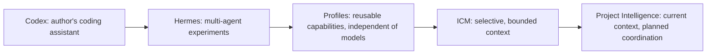

# Vision: from Project Map to Project Intelligence

[Home](../README.md) · [Concepts](CONCEPTS.md) · [Architecture](ARCHITECTURE.md) · [Current status](CURRENT_STATUS.md)

This document explains the direction of **Hermes Nexus**, the current product
name of `hermes-nexus`. It is a vision, not a feature-completion
claim. The [status overview](CURRENT_STATUS.md) separates implemented behavior
from planned capabilities and proposals. The story below is the author's
reported experience, not a claim about every developer or every tool setup.

## How the problem emerged

The project began as a code map: a way to inspect structure, find symbols and
follow dependencies. That remains useful, but the development workflow changed.

Initially, the author used Codex as a coding assistant. As more implementation was
delegated to AI, the author's work shifted toward deciding the architecture,
decomposing changes into tasks, setting boundaries and validating the result.
Writing code did not disappear; directing and checking larger amounts of
AI-written code became a more important part of the job.

Experimenting with Hermes made multi-agent workflows more attractive. In the
author's setup at that time, subagents used the same model. The author built a
tool to delegate to different profiles. This is a historical description of
that setup, not a claim about current Hermes limitations or a bundled feature
of this service.

A task could involve an architect, an implementer, a tester and a reviewer
rather than one long coding conversation. These responsibilities needed to be
reusable across projects without tying each role to one model or provider.
That led to **Profile != Model**: the role expresses responsibilities;
model/provider selection, execution and fallbacks belong to Hermes runtime policy.



This is the evolution of the project's motivation, not a release timeline or a
claim that the full coordination layer is available today.

## What ICM taught us

Discovering ICM through Clif Notes influenced the author's approach: give an
agent structured, selective project context rather than an undifferentiated
repository dump. In this project, versioned workspace contracts and localized
documents describe inputs, constraints, expected outputs and success criteria.

This is a design choice and source of inspiration, not a claim that ICM requires
one model, forbids multiple agents or cannot support other workflows.

This makes context selection an explicit part of the system. It also makes the
limits visible: a short context is not necessarily a correct context. Documents
can be stale, references can be incomplete and a relevant dependency can sit
outside the directory being edited.

**ICM is an input to Project Intelligence, not the entire system and not the
runtime.** The repository's ICM implementation indexes declarations and
contextual documents; it does not launch agents or authorize their mutations.

## Why context optimization is not enough

Multi-agent coding creates questions that a smaller prompt cannot answer alone:

- Are both agents working on the same project and the intended Git revision?
- Does an interface change affect another task's implementation or tests?
- Which files may this task change, and which should it only watch?
- Can two tasks proceed together even if their edits do not overlap textually?
- Is an observation about the project still true, or only historically useful?

Separate worktrees prevent agents from overwriting the same working directory.
They do not prevent incompatible changes to a shared contract. Locking every
related file is not a solution either: it would serialize work that could safely
proceed in parallel.

For example, one task may change a service interface while another changes its
consumer. Their diffs can touch different files and still be incompatible.
Useful coordination needs dependency and change-impact evidence, not just a
list of filenames or a reduced token count.

## What Project Intelligence adds

The intended layer connects task intent to the repository as it exists now:

```text
Task
 + ICM
 + current code
 + symbols/dependency graph
 + Git revision and worktree evidence
 + impact
 + relevant project knowledge
 = bounded Context Pack / coordination intelligence
```

Steps 1, 2 and 2.5 are complete at the documented checkpoint. The current Context
Pack implements a bounded subset of this equation: task, identity/revision, ICM
declarations, file/symbol/direct-reference evidence and heuristic test candidates.
It now consumes normalized analyzer providers, retaining capability and coverage
limits rather than assuming all observed languages were analyzed. Native
analysis is structural, not compiler-grade semantic truth.

Impact v2 is next and not started. Effective scopes, concurrent-task conflicts
and validated historical retrieval remain planned.

The direction is to provide:

1. **Project awareness:** stable project identity and explicit checkout/revision
   evidence, rather than assuming a folder name identifies the work.
2. **Selective context:** bounded evidence with provenance, limitations and
   reasons for relevance.
3. **Impact-aware scope:** distinguish intended writes, strongly coupled
   reservations, watched consumers and informational transitive impact.
4. **Conflict intelligence:** explain where concurrent tasks may interfere,
   without becoming their scheduler.
5. **Project knowledge:** retain validated, project-scoped history and eventually
   expose a read-only Project Expert that checks it against current evidence.

## Complement Hermes, do not replace it

Hermes owns runtime execution: agents, profiles/SOULs, models/providers,
Kanban/tasks, workers, worktrees, sessions and retries.

This project owns project understanding: relevant context, ICM, impact,
effective task scope, conflict intelligence and project knowledge. Some of that
responsibility is implemented; some is the target architecture.

Project Intelligence supplies evidence and coordination results. Hermes remains
responsible for scheduling and enforcement. The intended guard integration is
not a second orchestrator, and the service is not a sandbox.

## Learning should follow validation

A future Project Expert should retrieve current code, ICM and architecture
decisions, then use validated history where relevant. It must not treat every
agent statement as durable truth or encode volatile code only in model weights.

Project-scoped telemetry should enrich Hermes's existing runtime records, not
replace its task database. Tests, review and human feedback can help qualify
observations for later use. Model adaptation is deferred until there is useful,
validated data and evidence that adaptation helps.

The desired outcomes are better task relevance, clearer boundaries and fewer
coordination failures. These are evaluation goals, not measured benefits.
There is no public token-reduction percentage or autonomy guarantee here.

## Name and boundaries

**Hermes Nexus** is the current name. It evolved from **Hermes Project Map**,
which reflected the original code-map focus. The new name reflects the broader
Project Intelligence and coordination scope without changing the boundary with
Hermes runtime.

Continue with [core concepts](CONCEPTS.md), the [public architecture](ARCHITECTURE.md)
or the [technical architecture index](project-intelligence/00_INDEX.md).
